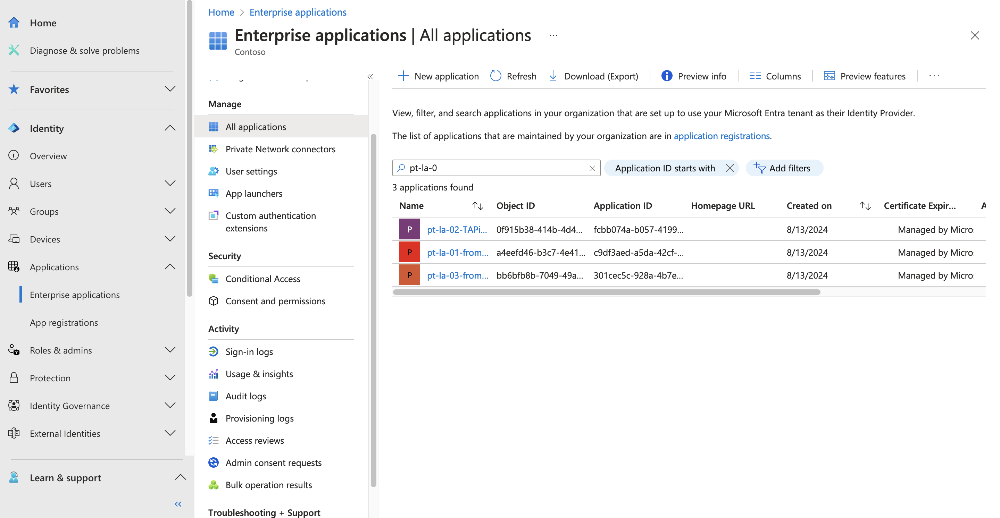

# Passwordless Transition - Proof of Concept

This repository offers a comprehensive overview of the passwordless transition process. It focuses on a Proof of Concept developed during an internship at Microsoft, aiming to serve as a reference for future implementations and migrations towards passwordless authentication in Azure.

It is important to note that this deployment is a simplified version of a test environment with additional resources and configurations. Passwords, usernames, and ports are placeholders and should be changed before deploying the demo.

## 1. Reproduce the PoC

After cloning the repository the following actions should be performed in order to fully reproduce the demo environment. The objective is to follow a step by step procedure that allows to reproduce the same exact setup used for the project. The architecture is not a copy of the production one and it is designed to have the minimum elements to proceed in the transition.

### 1.1 Setting up the infrastructure

To lay the ground for the upcoming implementation, we need a complete infrastructure that will be configured and setup later. Specifically, we need three logic apps, one sql server and one sql database that runs on it, one virtual machine and a properly configured network environment.

1. Create a **config.json** file in the **sql-infra** folder and fill it your values for:

    {
        "subscriptionId": "sub_id",
        "maintenanceConfigurationId": "/subscriptions/sub_id/providers/Microsoft.Maintenance/publicMaintenanceConfigurations/SQL_Default",
        "adminLogin": "admin@your_domain.com",
        "adminSID": "admin_sid",
        "tenantId": "tenant_id",
        "clientIpValue": "your_id",
        "privateEndpointDnsRecordUniqueId":"unique_id1",
        "privateEndpointNestedTemplateId":"unique_id2",
        "administratorLoginPassword":"strong_password"
    }

2. Fill the logic apps **template.json** and **parameters.json** file with your subscription ID 

3. Run the **main-infra.sh** to reproduce the following architecture:

### 1.2 Assign proper permissions and finalize configuration

To complete the infrastructure setup, we need to configure the logic apps and sql server to have the right permissions and connections. Logic apps will interact with Entra ID users and will log operations in the sql database. 

Logic apps are similar to users and groups for Entra ID, meaning that we can assign permissions to roles to each one of them. As they deliver different function, their permissions are specific to the single workload. 

The SQL Database needs to be configured to host data in the proper format and allow secure connections with the logic apps.

1. Verify the presence of the logic apps in the **Enterprise application** menu in the Entra ID portal. They should look like this:

2. Modify with the correct TenantID and run the powershell scripts: permissions-la-01-staging-users.ps1, permissions-la-02-TAP-delivery.ps1, permissions-la-03-committing-users.ps1.

3. Review in the portal the correct assignment of the permissions and roles. In case of errors, refer to the specific powershell script in the "tools" folder.

4. To complete the SQL setup, connect to the main database and run the scripts on **sql** folder of the **configuration**.

### 1.3 Configure the transition manager

To properly setup the logic to transition the users to passwordless transition we have to create a workflow for each logic app. The workflows hold the code to act on the users, groups, log information and external connections.

1. Set up each logic app with a stateful workflow. In Azure, it looks as follows:

2. Insert in each workflow code space, the proper script contained in the **transition-management** folder. Follow the numbering in the folder, Logic app 1 has to hold the code of the first workflow and so on.

3.